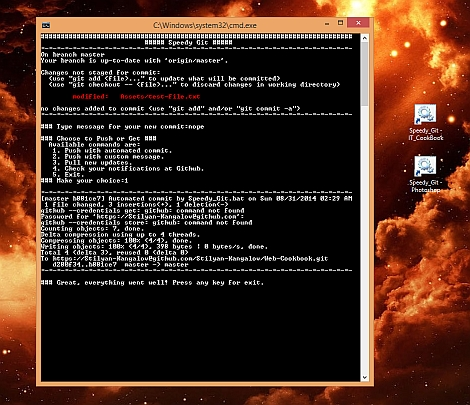

Speedy Git
==========

### Speed optimisation tool for custom Github workflow.

You might be interested with this script, if you work with Git / Github for Windows desktop application. It can be used with Windows 8.1 / 7 desktop environments. The set-up process it's not very long and you can do a lot customisations, in order to fit different types of cases.

#### It runs git commands in a row, when you just type "1/2/3" and then hit "Enter".

#### Advantages:

-  ##### Instant access to the repo's path and no need to navigate.

-  ##### Skip regular input and set-up your own commands.

-  ##### Save time with command for commit with message based by template. That's right - forget about the efforts to fix issues, inflicted by omitted "" around the text!

-  ##### Perfect utility for personal projects and repos handled by yourself.

-  ##### You don't need to launch the desktop app for simple tasks.

-  ##### It can be expanded with more options.

#### Disadvantages:

-  ##### It is not full featured replacement for Github! You must clone your repos, add SSH keys and fix __complicated issues__ in the regular way!

-  ##### If you use it with __"Github for Windows"__, you must enter your account credentials after the push command. (http style) I'll include one work-around latter in the article.

-  ##### Not suitable in __big projects__ without improvements, refactoring and really __careful usage!__

#### Installation Process: